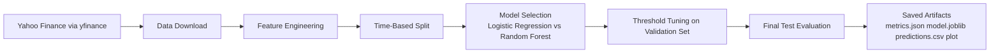

# Stock Price Trend Prediction

This repository contains a working end-to-end machine learning pipeline for predicting whether Apple stock will gain more than 1% over the next 10 trading days. The project uses Yahoo Finance historical market data, engineers technical indicators, selects the best model on a validation split, evaluates on a held-out test split, and saves reproducible artifacts for reporting.

The default validated configuration is deliberately focused instead of broad: `AAPL`, forecast horizon `10`, positive target threshold `1%`, and automatic model selection between logistic regression and random forest. The current best validated run selects a random forest classifier and reaches a test balanced accuracy of `0.5581`, above the `0.5000` majority-class baseline and the `0.5121` previous-day-direction baseline.

## What The Project Does

- Downloads historical OHLCV data from `yfinance`
- Engineers momentum, moving-average, volatility, RSI, stochastic, gap, and volume features
- Creates a binary target: `1` when the next 10-trading-day return is greater than `1%`
- Splits data chronologically into train, validation, and test sets
- Compares logistic regression and random forest models
- Tunes the classification decision threshold on the validation set
- Saves the trained model, metrics, predictions, feature ranking, and a plot to disk
- Saves proof artifacts including raw input data, engineered features, scored test data, benchmark tables, and evaluation charts

## Validated Results

These numbers come from the saved run in `artifacts/latest/metrics.json`.

- Ticker: `AAPL`
- Historical period used after feature engineering: `2015-03-16` through `2024-12-16`
- Rows after feature engineering: `2457`
- Best model: `random_forest`
- Decision threshold: `0.35`
- Test accuracy: `0.5081`
- Test balanced accuracy: `0.5581`
- Test ROC AUC: `0.5650`
- Majority-class baseline balanced accuracy: `0.5000`
- Previous-day-direction baseline balanced accuracy: `0.5121`
- Mean future return across all test rows: `0.0148`
- Mean future return when the model predicts up: `0.0363`

## Project Structure

- `trendpredictor.py`: training, validation, model selection, evaluation, and artifact saving
- `tests/test_trendpredictor.py`: deterministic tests for feature engineering, chronological splitting, and end-to-end artifact generation
- `requirements.txt`: Python dependencies
- `docs/final_project_report.md`: report content for the sprint submission, including Mermaid diagrams
- `docs/mermaid_diagrams.md`: standalone Mermaid diagrams for the report and presentation
- `docs/proof_of_execution.md`: execution evidence and artifact guide
- `docs/video_demo_runbook.md`: step-by-step command sequence for recording the demo video
- `artifacts/latest/`: validated output from the latest default run

## Setup

Create or activate a virtual environment, then install dependencies:

```bash
python -m venv .venv
source .venv/bin/activate
pip install -r requirements.txt
```

## Run The Pipeline

Default validated run:

```bash
python trendpredictor.py --output-dir artifacts/latest
```

Optional examples:

```bash
python trendpredictor.py --tickers AAPL MSFT NVDA --output-dir artifacts/tech_basket
python trendpredictor.py --tickers AAPL --forecast-horizon 5 --target-return-threshold 0.005 --output-dir artifacts/custom_run
```

## Run Tests

```bash
python -m pytest -q
```

## Saved Artifacts

Each run writes the following files to the chosen output directory:

- `metrics.json`: full configuration, metrics, baselines, and feature ranking
- `model.joblib`: trained scikit-learn pipeline
- `raw_market_data.csv`: raw downloaded Yahoo Finance records
- `engineered_features.csv`: engineered modeling dataset
- `predictions.csv`: row-level predictions and probabilities for the test split
- `scored_test_dataset.csv`: test dataset with engineered features and predictions
- `benchmark_summary.csv`: benchmark comparison table
- `confusion_matrix.csv`: confusion matrix table
- `confusion_matrix.png`: confusion matrix chart
- `feature_importance.png`: feature-importance chart
- `top_features.csv`: ranked feature importances for the selected model
- `prediction_plot.png`: predicted probability chart for the focus ticker
- `summary.txt`: short text summary of the run

## Architecture Overview



## Notes

- This project is a machine learning classification exercise for MLOps coursework, not a production trading system.
- Balanced accuracy is the primary headline metric because directional classes are not perfectly balanced and raw accuracy alone is misleading.
- The repository is ready to be pushed to GitHub, but creating a remote GitHub repository or link still requires your GitHub account or credentials.