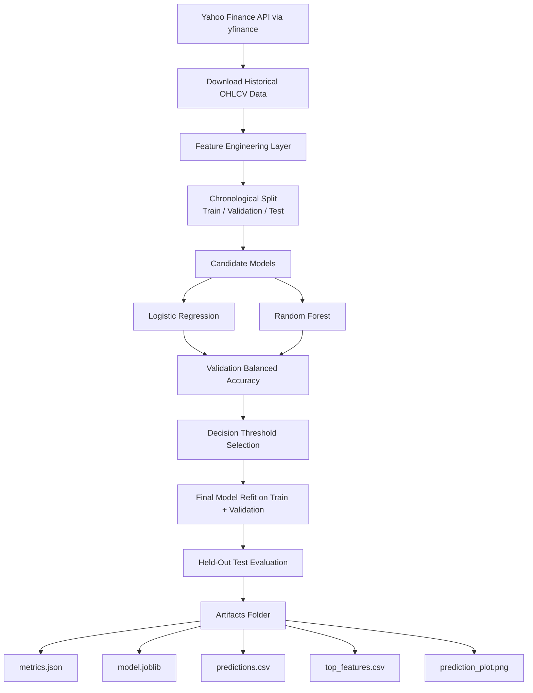
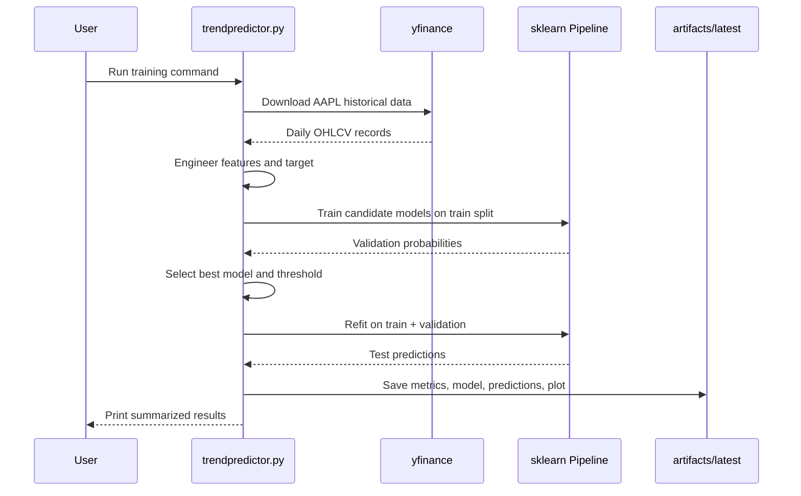
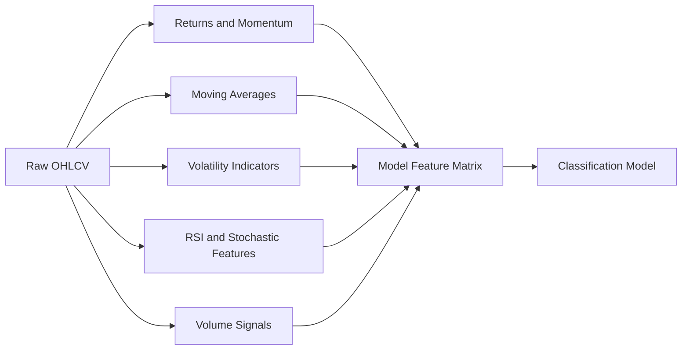

# Stock Price Trend Prediction

## Final Project Report

**Date:** March 30, 2026  
**Student Name(s):** [Replace With Submission Name]  
**Institution:** [Replace With Institution]  
**Class Number:** SDLC II  
**Instructor:** [Replace With Instructor Name]

\newpage

## Table of Contents

1. Project Overview
2. Key Features
3. Business Value
4. Technical Architecture
5. Implementation Summary
6. Validation Results
7. Future Directions
8. References

\newpage

## Project Overview

The Stock Price Trend Prediction project is a machine learning and MLOps-focused application designed to predict whether Apple Inc. stock (`AAPL`) will increase by more than 1% over the next 10 trading days. The project solves a practical forecasting problem: converting raw historical market data into a repeatable classification workflow that can be trained, validated, evaluated, and rerun with consistent outputs.

The final implementation uses Yahoo Finance historical OHLCV data through the `yfinance` Python library, engineers technical features from price and volume behavior, and evaluates multiple candidate models using chronological train, validation, and test splits. The purpose of the project is not to claim perfect market prediction, but to demonstrate a clean, defensible, end-to-end MLOps workflow with reproducibility, artifact tracking, automated testing, and documented evaluation.

The final validated baseline is intentionally focused on a single stock because it produced the strongest measured generalization result among the tested configurations. The final default configuration uses AAPL daily data from 2015 through the end of 2024, a binary target defined as future 10-day return greater than 1%, and automatic model selection between logistic regression and random forest.

\newpage

## Key Features

The application includes the following core features:

- Automated market data ingestion from Yahoo Finance using `yfinance`
- Feature engineering for momentum, moving averages, volatility, RSI, stochastic momentum, price gaps, and volume behavior
- Binary target generation based on forward 10-trading-day return exceeding 1%
- Chronological train, validation, and test splitting to avoid future-data leakage
- Automated model comparison between logistic regression and random forest
- Decision-threshold tuning using validation balanced accuracy instead of defaulting to 0.50 blindly
- Saved model artifacts for reproducibility and reporting
- Automated tests for feature engineering, time-based splitting, and end-to-end pipeline execution
- CLI-based execution for repeatable runs and easy reconfiguration

The final implementation also supports multi-ticker experimentation through CLI arguments, but the validated project baseline remains AAPL because it produced the best balanced test performance and the clearest reportable result.

\newpage

## Business Value

This project demonstrates business value in three practical ways.

First, it shows how historical financial data can be converted into an operational prediction pipeline rather than remaining an exploratory notebook or informal script. That matters because business-facing analytics systems require repeatability, controlled inputs, measurable outputs, and clearly stored artifacts.

Second, the model acts as a directional decision-support tool. Even though it is not a production trading engine, the system identifies subsets of observations with stronger expected forward returns. In the validated test run, the overall mean 10-day future return across test rows was approximately `1.48%`, while the mean 10-day future return for rows predicted as positive was approximately `3.63%`. That difference suggests the model is learning a useful ranking signal rather than random noise.

Third, the project has educational and operational value for a real MLOps workflow. It demonstrates ingestion, feature generation, validation-based model selection, test evaluation, artifact persistence, and test automation, all of which are transferable to business forecasting problems in finance, demand planning, risk scoring, and anomaly detection.

\newpage

## Technical Architecture

The system architecture is intentionally lightweight so the full pipeline can be run locally while still following a clear MLOps structure.

The data flow begins with historical market data download, followed by engineered technical indicators. The processed dataset is split chronologically to preserve time-series integrity. Candidate models are trained on the training split, scored on the validation split, and the best model is selected. A validation-tuned threshold is then applied to generate final predictions on the held-out test set. The final stage saves metrics, model weights, feature ranking, and prediction outputs.

\newpage

## Implementation Summary

The final implementation is contained in a reproducible Python script, `trendpredictor.py`. The file now acts as a CLI application instead of a one-off experiment. The main implementation stages are:

1. Downloading historical data using `yfinance`
2. Engineering 33 model features from price, return, volatility, and volume signals
3. Creating the binary target based on future 10-day return greater than 1%
4. Splitting the data into train, validation, and test partitions by date
5. Training both logistic regression and random forest classifiers
6. Selecting the best model using validation balanced accuracy
7. Tuning the classification decision threshold on the validation set
8. Refitting the chosen model on train plus validation data
9. Evaluating the final model on the held-out test set
10. Saving model artifacts and generated plots for reporting

The repository also includes a test suite in `tests/test_trendpredictor.py`. Those tests validate that feature engineering produces the expected columns, that the dataset split is strictly chronological, and that a full pipeline run produces all expected output artifacts.

\newpage

## Validation Results

The final validated default run used the following configuration:

- Ticker: `AAPL`
- Date range downloaded: `2015-01-01` to `2025-01-01`
- Final usable modeling window after rolling features: `2015-03-16` to `2024-12-16`
- Forecast horizon: `10` trading days
- Positive class threshold: `future return > 1%`
- Selected model: `random_forest`
- Selected threshold: `0.35`

Measured dataset summary:

- Raw rows downloaded: `2516`
- Rows after feature engineering: `2457`
- Feature count: `33`
- Train rows: `1474`
- Validation rows: `491`
- Test rows: `492`

Measured model performance on the held-out test set:

- Accuracy: `0.5081`
- Balanced accuracy: `0.5581`
- Precision: `0.7639`
- Recall: `0.1964`
- F1 score: `0.3125`
- ROC AUC: `0.5650`

Baseline comparison:

- Majority-class baseline balanced accuracy: `0.5000`
- Previous-day-direction baseline balanced accuracy: `0.5121`

Signal-quality summary:

- Mean future return across all test rows: `1.48%`
- Mean future return when the model predicts up: `3.63%`
- Predicted-up rate: `14.63%`

These results show a modest but measurable signal. The strongest evidence is not raw accuracy, which is affected by class imbalance, but balanced accuracy and the higher average forward return on model-selected positive cases.

\newpage

## Future Directions

The current project is complete for coursework purposes, but there are several practical next steps if the system were extended:

1. Add walk-forward cross-validation across multiple market regimes instead of using a single validation window.
2. Expand the model search to gradient boosting, XGBoost, or calibrated probability models.
3. Add feature-store style persistence and structured experiment tracking.
4. Package the prediction pipeline behind an API for dashboard or batch consumption.
5. Integrate scheduled retraining and drift monitoring.
6. Extend the project to multi-ticker or sector-level modeling only after evaluating whether the broader dataset improves out-of-sample performance.

\newpage

## References

1. Ran Aroussi. `yfinance` GitHub repository. https://github.com/ranaroussi/yfinance
2. `yfinance` documentation. https://ranaroussi.github.io/yfinance/
3. Scikit-learn documentation. https://scikit-learn.org/stable/