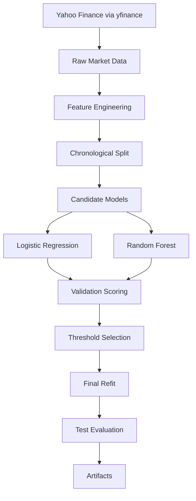
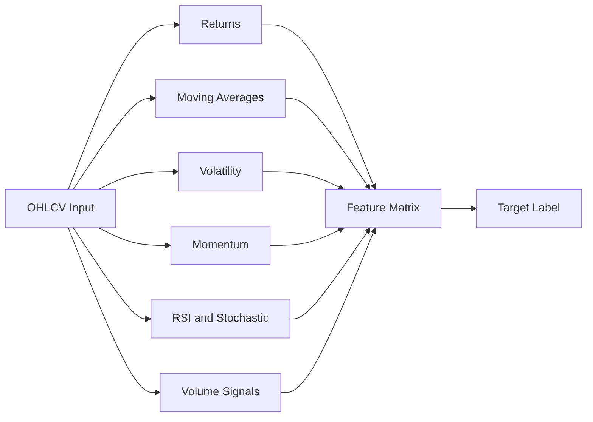
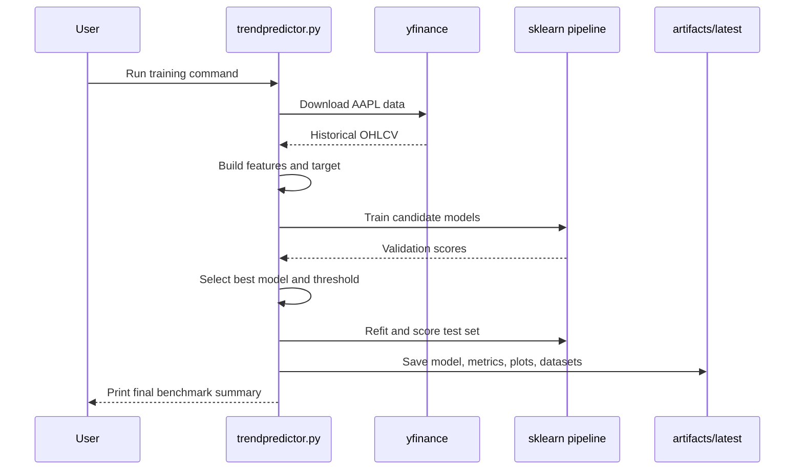
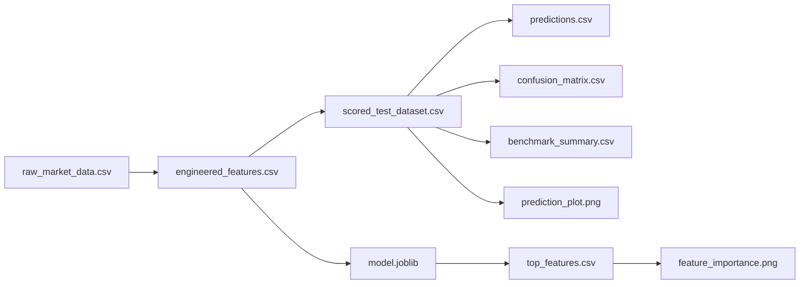
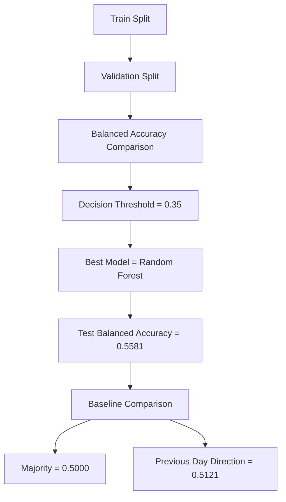

# Mermaid Diagrams

This file contains clean standalone Mermaid diagrams for the final report, README, presentation, and proof package.

## System Architecture

## Data And Feature Flow

## Execution Sequence

## Artifact Traceability

## Validation Summary Flow

