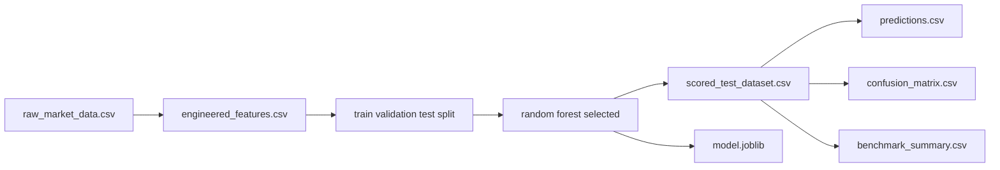

# Proof Of Execution

This document captures the concrete evidence that the Stock Price Trend Prediction project runs end to end, produces outputs, and was validated on real Yahoo Finance data.

## Execution Status

The project was executed successfully using the default validated command:

```bash
python trendpredictor.py --output-dir artifacts/latest
```

The run completed without errors and produced the full artifact set in `artifacts/latest`.

## Validation Summary

Validated default configuration:

- Ticker: `AAPL`
- Forecast horizon: `10` trading days
- Positive target threshold: `future return > 1%`
- Selected model: `random_forest`
- Threshold selected on validation split: `0.35`

Measured held-out test results:

- Accuracy: `0.5081`
- Balanced accuracy: `0.5581`
- Precision: `0.7639`
- Recall: `0.1964`
- F1 score: `0.3125`
- ROC AUC: `0.5648`

Baselines:

- Majority-class balanced accuracy: `0.5000`
- Previous-day-direction balanced accuracy: `0.5121`

Interpretation:

The model is not a high-accuracy trading system, but it does outperform both reference baselines on balanced accuracy and identifies a subset of higher-return positive cases.

## Artifact Inventory

Generated artifacts in `artifacts/latest`:

- `metrics.json`: full run configuration and evaluation output
- `summary.txt`: compact summary of the run
- `model.joblib`: trained model pipeline
- `raw_market_data.csv`: downloaded Yahoo Finance input data
- `engineered_features.csv`: engineered modeling dataset
- `predictions.csv`: compact prediction output for the held-out test set
- `scored_test_dataset.csv`: scored test dataset with features and predictions
- `benchmark_summary.csv`: model and baseline comparison table
- `confusion_matrix.csv`: confusion matrix table
- `prediction_plot.png`: probability timeline visualization
- `confusion_matrix.png`: confusion matrix image
- `feature_importance.png`: feature-importance image
- `top_features.csv`: ranked feature importances

## Input To Output Traceability

The evidence trail from input to output is:

1. `raw_market_data.csv` proves the data source and downloaded records.
2. `engineered_features.csv` proves the transformed feature set used for modeling.
3. `scored_test_dataset.csv` proves the exact held-out rows scored by the model.
4. `predictions.csv` gives a concise row-level prediction view.
5. `benchmark_summary.csv` and `metrics.json` prove benchmark comparison and final scores.
6. `model.joblib` proves the trained model artifact was persisted.

## Sample Prediction Output

Example rows from the held-out prediction output:

```text
Date,Ticker,Close,Future_Return,Target,Predicted_Probability,Predicted_Target,Correct
2023-01-03,AAPL,123.0960,0.0811,1,0.5583,1,1
2023-01-04,AAPL,124.3657,0.0705,1,0.5346,1,1
2023-01-05,AAPL,123.0468,0.1028,1,0.5376,1,1
```

## Benchmark Table

```text
stage,name,accuracy,balanced_accuracy,precision,recall,f1,roc_auc,decision_threshold
validation,logistic_regression,,0.5000,,,,,0.35
validation,random_forest,,0.5011,,,,,0.35
test_baseline,majority_class,0.5691,0.5000,,,,,
test_baseline,previous_day_direction,0.5203,0.5121,,,,,
test_model,random_forest,0.5081,0.5581,0.7639,0.1964,0.3125,0.5648,0.35
```

## Confusion Matrix

```text
          pred_0  pred_1
actual_0     195      17
actual_1     225      55
```

## Visual Evidence

The following images were generated automatically by the pipeline and are suitable for screenshots in the final submission:

- `artifacts/latest/prediction_plot.png`
- `artifacts/latest/confusion_matrix.png`
- `artifacts/latest/feature_importance.png`

## Mermaid Overview

